# ¡Trabajemos con proyectos Reaktor!

Si estás aquí es porque quieres lanzar una serie de proyectos Reaktor o quieres adaptar tu proyecto Spring Boot al formato Reaktor.

En esta guía vamos a comenzar aprendiendo [cómo arrancar un proyecto Reaktor en tu entorno local](#lanzando-reaktor-en-tu-máquina-local). Esto conlleva no solo la descarga de dependencias, sino también la generación de una serie de ficheros de configuración, la creación de un proyecto en Google Firebase y la descarga de sus ficheros de configuración para añadirlos a los anteriores. ¡Parece mucho! ¡Pero en esta guía paso a paso verás que es muy fácil! De esta forma, para arrancar el entorno Reaktor tenemos los siguientes apartados:

- [Requisitos](#requisitos): todo aquel software necesario para poder trabajar.

- [Proyectos necesarios para importar](#proyectos-necesarios-para-importar): verás los proyectos necesarios para poder arrancar el entorno Reaktor.
  
- [Importación y compilación en Eclipse](#importación-y-compilación-en-eclipse): te explicaré cómo importar los proyectos en Eclipse y cómo realizar el proceso de compilación. No estás obligado a usar Eclipse, usa cualquier Entorno de Desarrollo en el que estés más cómodo que tengas configurado con Java y Maven.
  
- [Conocer el fichero de configuración application.yaml](#fichero-de-configuración-applicationyaml): entenderás el fichero de configuración y las propiedades específicas de Reaktor.

- [Cómo configurar Google Firebase y lanzar la web somosjandula](#cómo-configurar-google-firebase): aprenderás a configurar Google Firebase ya que aquí es donde se realizará el proceso de autenticación.
  
- [Creación de usuarios en la BBDD de nuestro microservicio FirebaseServer](#creación-de-usuarios-en-la-bbdd-de-nuestro-microservicio-firebaseserver): será necesario que crees al menos un usuario con tu correo electrónico y con los roles pertinentes para poder acceder a la aplicación.

- [Cómo lanzar la web somosjandula](#cómo-lanzar-la-web-somosjandula): aprenderás a lanzar la web de somosjandula.

## Lanzando Reaktor en tu máquina local

En esta sección iremos paso a paso configurando tu entorno local para que puedas desplegar todo el entorno Reaktor en tu máquina.

### Requisitos

- [Eclipse for Java Developers](https://www.eclipse.org/downloads/)
- [Maven](https://maven.apache.org/download.cgi): normalmente viene instalado por defecto en Eclipse, pero por si acaso tienes el enlace de descarga aquí.
- [Open SSL](https://slproweb.com/products/Win32OpenSSL.html): se explica más abajo cómo descargarlo, configurarlo e instalarlo.
- Google Firebase: se explica [aquí](#cómo-configurar-google-firebase) como configurarlo.
- [Node.js](https://nodejs.org/en/download): versión 20.10 o parecida.

### Proyectos necesarios para importar

Los proyectos Maven de Reaktor previos a importar y necesarios para comenzar a trabajar con otros microservicios:

- [Dependencies](https://github.com/IESJandula/Reaktor_Dependencies/): contiene todas las dependencias de los proyectos Reaktor. Realmente, es un pom.xml con todas las librerías básicas, no tiene código Java. Luego, no tendrás que arrancarla ya que es una simple librería.

- [Base](https://github.com/IESJandula/Reaktor_Base/): contiene funcionalidades de reinicio automático, entre otras utilidades interesantes que son comunes a cualquier proyecto Reaktor, ya sea cliente o servidor. No tendrás que arrancarla ya que es una simple librería.

- [BaseServer](https://github.com/IESJandula/Reaktor_BaseServer/): posee funcionalidades de seguridad y todas aquellas dependencias comunes a cualquier servidor Spring Boot. Cabe destacar, que la mayoría de los proyectos son servidores, ya que ofrecen recursos a los que insertar, actualizar, consultar y borrar. No tendrás que arrancarla ya que es una simple librería.

- [BaseClient](https://github.com/IESJandula/Reaktor_BaseClient/): posee funcionalidades para la petición de JWTs al microservicio Firebase y todas aquellas dependencias comunes a cualquier cliente Spring Boot. Destacamos aquí que existen proyectos que son clientes puros como el [cliente de impresión remota](https://github.com/IESJandula/Reaktor_PrintersClient/) que realizan llamadas a servidores para informar o recibir información de estos. Por otro lado, también existen servidores que a su vez son clientes, por ejemplo, el [servidor de reservas de recursos](https://github.com/IESJandula/Reaktor_BookingServer) ya que preguntan cierta información a otro servidor, en este caso a [FirebaseServer](https://github.com/IESJandula/Reaktor_FirebaseServer/). Cabe destacar que no tendrás que arrancarla ya que es una simple librería.

- [FirebaseServer](https://github.com/IESJandula/Reaktor_FirebaseServer/): es el microservicio que puede recibir peticiones de clientes como la web de [Somos Jándula](https://github.com/IESJandula/somosjandula/), clientes como [cliente de impresión remota](https://github.com/IESJandula/Reaktor_PrintersClient/) o como servidores tales como el [servidor de reservas de recursos](https://github.com/IESJandula/Reaktor_BookingServer). ``FirebaseServer`` se encarga de validar el JWT generado por Google Firebase para generar otro JWT propio de Reaktor que contiene el email, nombre y apellidos, y roles de la persona que se ha logueado a través de [Somos Jándula](https://github.com/IESJandula/somosjandula/). Para las aplicaciones cliente (que no son personas) como [cliente de impresión remota](https://github.com/IESJandula/Reaktor_PrintersClient/) también le asigna un JWT propio pero que en lugar de un email, nombre y apellidos, posee un identificador de aplicación. Por último ``FirebaseServer`` ofrece la posibilidad de consultar datos de los usuarios del sistema entre otro de sus endpoints, siendo útil para el [servidor de reservas de recursos](https://github.com/IESJandula/Reaktor_BookingServer), entre otros. Cabe destacar que al ser un microservicio, deberás arrancarlo para que reciba peticiones de autenticación.
  
- [Somos Jándula](https://github.com/IESJandula/somosjandula/): es la web con la que se accede mediante el navegador a la plataforma. Necesitarás Node.js instalado. Más abajo existe una sección donde se explica cómo arrancarlo. Usa un Entorno de Desarrollo preparado para el desarrollo web, por ejemplo, VSC, Cursor, Intellij, etcétera.
  
- Y ahora llega el momento...¿qué microservicio adicional quieres lanzar? Actualmente tenemos varios:
  
    - [Servidor de impresión remota](https://github.com/IESJandula/Reaktor_PrintersServer): recibe peticiones de impresión de usuarios desde la web de [Somos Jándula](https://github.com/IESJandula/somosjandula/) y las deja pendientes hasta que las recoge el [cliente de impresión remota](https://github.com/IESJandula/Reaktor_PrintersClient/). Luego, tendrías que importar tanto el cliente como el servidor, junto con la web.
      
    - [Servidor de reservas de recursos](https://github.com/IESJandula/Reaktor_BookingServer): recibe peticiones de reservas de recursos de usuarios ya sean fijas o temporales desde la web de [Somos Jándula](https://github.com/IESJandula/somosjandula/). Luego, tendrías que importar el servidor y la web.
      
    - [Gestión de matrículas](https://github.com/IESJandula/Reaktor_SchoolManagerServer): recibe las matrículas de los alumnos y a partir de ahí nos ofrece la posibilidad de gestionar las asignaturas, profesorado asignado, creación de grupos, etcétera. Todo ello, desde la web de [Somos Jándula](https://github.com/IESJandula/somosjandula/). Luego, tendrías que importar el servidor y la web.
      
    - [Gestión de incidencias](https://github.com/IESJandula/Reaktor_IssuesServer): recibe incidencias de usuarios desde la web de [Somos Jándula](https://github.com/IESJandula/somosjandula/) y notifica a la persona que debería resolverla la notificación de dicha incidencia. Luego, tendrías que importar el servidor y la web.
 
    - Faltan muchos más proyectos que poco a poco iremos migrando, como: [el servidor de monitorización remota](https://github.com/IESJandula/Reaktor_MonitoringServer) y su [cliente](https://github.com/IESJandula/Reaktor_MonitoringClient), [el servidor para obtener los horarios y ubicaciones del profesorado y alumnado](https://github.com/IESJandula/Reaktor_TimetableServer), [un escaneador de equipos de red](https://github.com/IESJandula/Reaktor_NetworkServer) y [el proyecto Lince](https://github.com/IESJandula/Lince_ServerJava) que nos faltaría modificar su [código Flutter](https://github.com/IESJandula/Lince_Flutter) para que ahora funcione con JWTs. ¿Te animas a migrar alguno de ellos? [Realiza una petición por aquí](https://github.com/IESJandula/Reaktor_Documentacion/issues/new?title=Quiero%20participar%20en%20el%20proyecto...&body=Explica%20aquí%20el%20proyecto%20que%20querrías%20participar...)

### Importación y compilación en Eclipse

Todos los proyectos necesarios anteriores han de importarse en tu entorno de programación favorito. Yo suelo usar ``Eclipse`` para los servidores y clientes Java, y ``Visual Studio Code`` para la web. En ``Eclipse`` necesitamos tener todos los proyectos a utilizar dentro del mismo workspace. Para ello, los incluimos importándolos como proyecto ``maven`` siguiendo estos pasos:

<div style="display: flex; justify-content: space-between; align-items: flex-start;">
    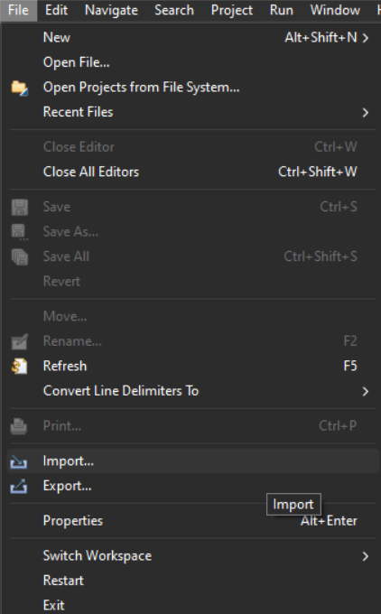
    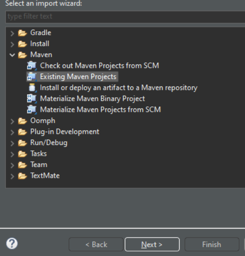
</div>

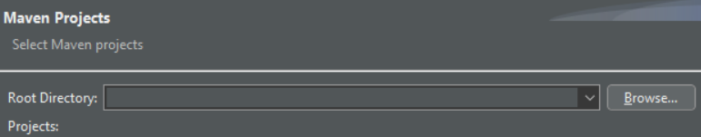

En browse anterior elegimos la carpeta raíz de cada proyecto ``maven`` a importar y hacemos clic en finish cuando veamos que detecta el POM. Una vez lo tenemos importado es importante hacerle un clean install, para ello hacemos click derecho y venimos aquí:

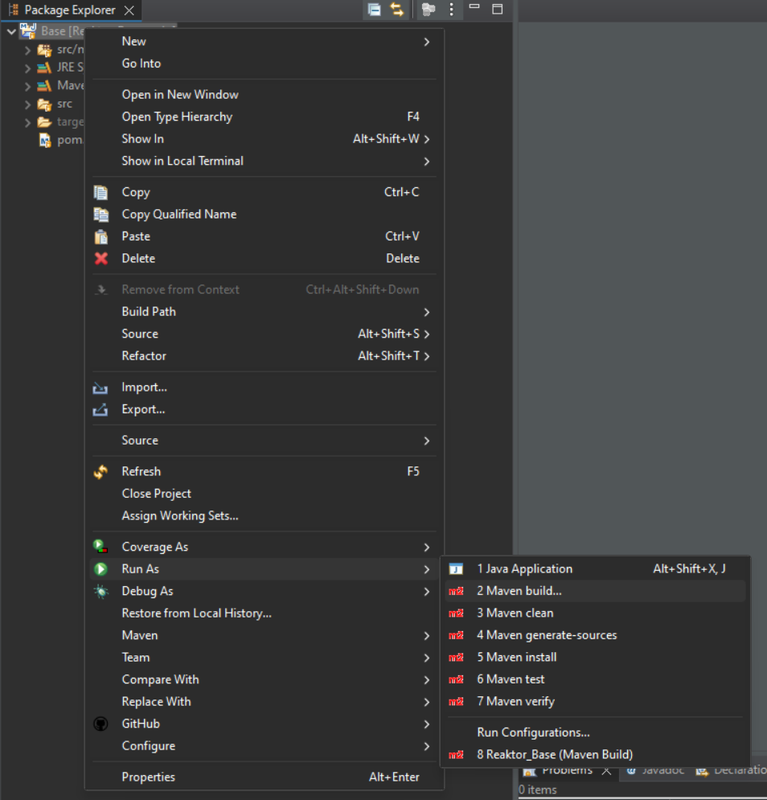

En ``maven build``, en goals, escribimos ``clean install`` y ejecutamos:

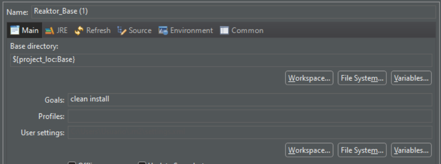

Así aparece si sale bien:

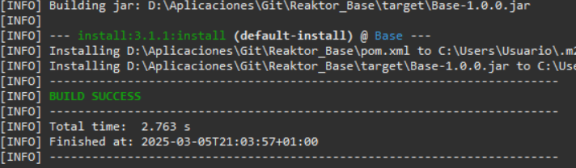

**Importante**: Hay que tener en cuenta el orden a la hora de instalar estos módulos ya que alguno puede depender de que otro esté ya instalado anteriormente. Por ello, el orden es el siguiente:

1. [Dependencies](https://github.com/IESJandula/Reaktor_Dependencies/)
2. [Base](https://github.com/IESJandula/Reaktor_Base/)
3. [BaseServer](https://github.com/IESJandula/Reaktor_BaseServer/)
4. [BaseClient](https://github.com/IESJandula/Reaktor_BaseClient/)
5. [FirebaseServer](https://github.com/IESJandula/Reaktor_FirebaseServer/)
6. El/Los proyecto/s que quieras lanzar clientes o servidores ``Java``.
7. [Somos Jándula](https://github.com/IESJandula/somosjandula/) 

### Fichero de configuración application.yaml

Llegados a este punto, es importante que conozcáis los ficheros de configuración antes de arrancar la aplicación, ya que sin una configuración correcta no vais a poder arrancar los clientes y servidores. Antes de nada descarga e instala la versión Community de MySQL(https://dev.mysql.com/downloads/windows/installer/8.0.html), ya que los servidores almacenan información en BBDD. Recuerda también ponerle al usuario de ``root`` la contraseña ``toor`` ya que es la que tienen por defecto todos los ``application.yaml`` (¡sino vas a tener que modificar uno a uno los ficheros de los proyectos!).

Una vez hecho esto, vamos a ver una serie de propiedades interesantes que posee el fichero ``application.yaml`` de uno de los proyectos microservicios que hemos descargado (puede tener más en función del proyecto, pero estas son las más interesantes):

```
reaktor:
 publicKeyFile: C:\claves\public_key.pem
 privateKeyFile: C:\claves\private_key.pem
 googleCredentialsFile: C:\claves\firebaseGoogleCredentials.json
 urlCors: http://localhost:5173, http://192.168.1.209:5173
```

Aquí te explico que son cada una de ellas:

- **reaktor.privateKeyFile**: es una ruta al archivo de clave privada, siendo solo necesaria en el proyecto ``FirebaseServer``. Como decía arriba, Reaktor genera sus propios JWT y como se puede sobreentender es ``FirebaseServer`` quien los genera, por lo que es importante que tengas en cuenta cómo crear la clave privada, pero solo se utilizará por el microservicio anterior. Se almacena en `C:\claves`. Para conseguirla, genera la clave privada utilizando el siguiente comando en la terminal del sistema operativo:

```
openssl genrsa -out C:\claves\private_key.pem 2048
```

- **reaktor.publicKeyFile**: es una ruta al archivo de clave pública, siendo necesaria en todos los proyectos. Como sabes, Reaktor genera sus propios JWT. Pues bien, para aquellos microservicios que quieran validar si el JWT es correcto, se usa esta clave pública para ello. Se almacena en `C:\claves`. Para conseguirla, genera la clave pública utilizando el siguiente comando en la terminal del sistema operativo:

```
openssl rsa -in C:\claves\private_key.pem -pubout -out C:\claves\public_key.pem
```

¡Recuerda que si estás en Windows tienes que añadir a las variables del sistema (PATH) la ruta de la carpeta "bin" de openssl!

- **reaktor.googleCredentialsFile**: es una ruta al archivo JSON de credenciales de Firebase, siendo solo necesaria en el proyecto FirebaseServer. Se almacena en `C:\claves`. Se explica cómo conseguirla en el apartado [Cómo configurar Google Firebase y lanzar la web somosjandula](#cómo-configurar-google-firebase).

- **reaktor.urlCors**: es una lista de orígenes permitidos para las solicitudes CORS, siendo necesaria en todos los proyectos. Esto es para que solo las URLs que indiquemos sean las que permite el servidor para recibir peticiones. Por ejemplo: `http://localhost:5173, http://192.168.1.209:5173`.

Llegado a este punto, podrás preguntarte de dónde puedes descargar el software openssl. Para ello, debes realizar la descarga desde [aquí](https://slproweb.com/products/Win32OpenSSL.html), eligiendo esta opción:

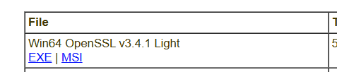

Una vez instalado, debes añadir a las variables de entorno de Windows la carpeta de instalación:

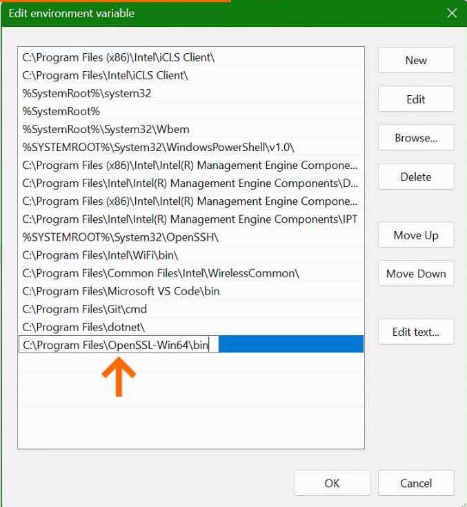

### Cómo configurar Google Firebase

Para crear una cuenta en firebase usaremos una cuenta de google, siguiendo estos pasos:

1. Entramos a la [Consola de firebase](https://console.firebase.google.com/)

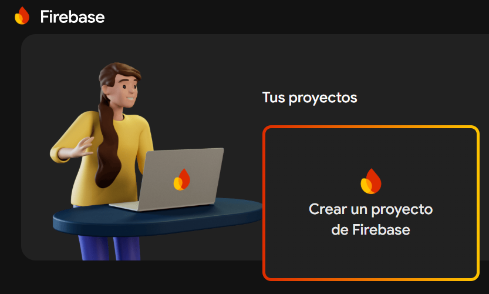

2. Elegimos un nombre (el que quieras) y damos a continuar hasta el final (google analytics no es necesario) para crear el proyecto..

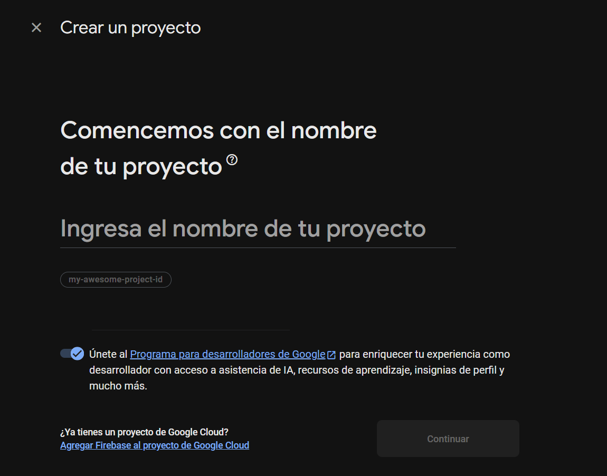

3. Una vez creado elegimos utilizar firebase en nuestra aplicación ``web`` desde este botón:

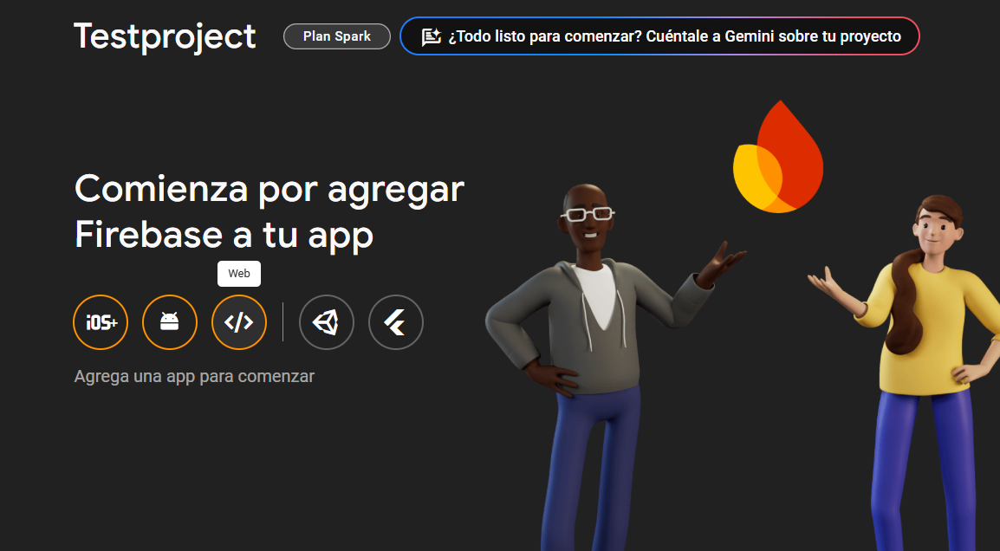

4. Elegimos nombre y registramos

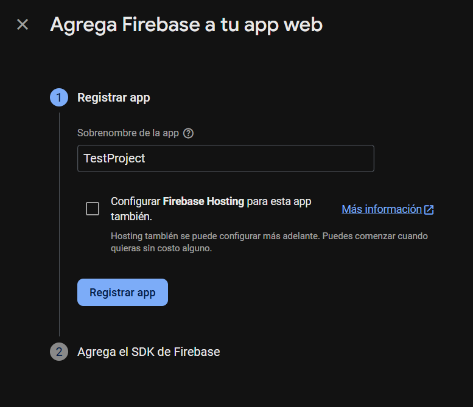

5. Esto nos genera el siguiente bloque de código (que usarás en el apartado [Cómo lanzar la web somosjandula](#cómo-lanzar-la-web-somosjandula)):

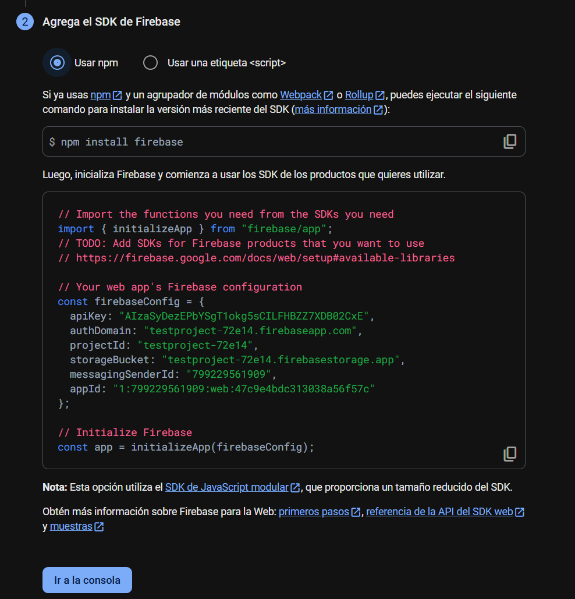

6. Debes descargarte un fichero de clave privada (Botón de la imagen `Generar nueva clave privada`) que almacenarás en `C:\claves`. Este será el fichero que hablamos más arriba asociado a la propiedad **reaktor.googleCredentialsFile**:

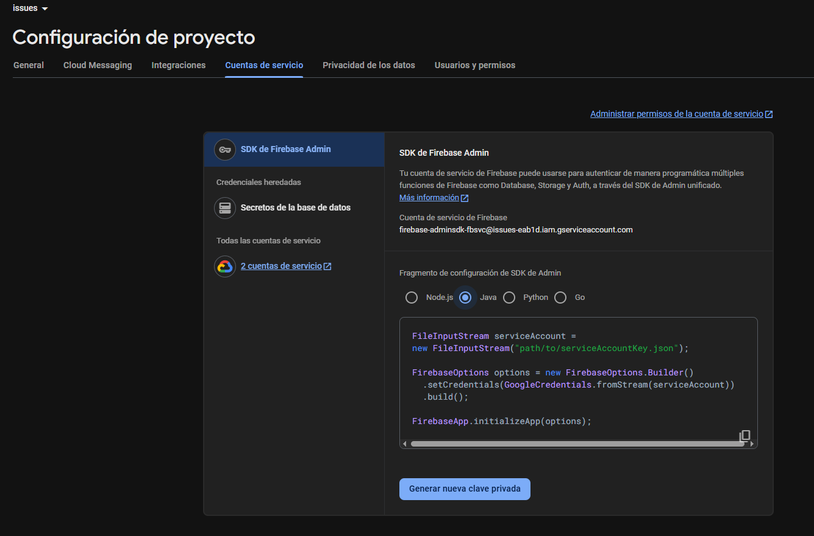

7. Por último, debes activar la autenticación mediante Google, tras como se indica en la imagen:

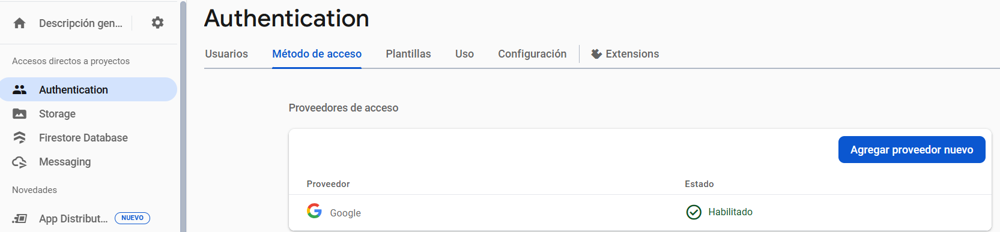

### Creación de usuarios en la BBDD de nuestro microservicio FirebaseServer

Antes de arrancar los servidores y clientes, para que el sistema funcione correctamente, es necesario dar de alta los usuarios que quieras que accedan a la aplicación. Normalmente, en entorno local solo te bastará añadir a tu usuario. Para ello, necesitarás realizar los siguientes pasos:

1. Acceder a la BBDD llamada ``reaktor_firebaseserver``:

```
use reaktor_firebaseserver
```

2. Hacer un ``INSERT`` en la tabla ``usuario`` con tu correo electrónico personal de Google (ya que la junta tiene capado el acceso a las APIs de Google Firebase):

```
INSERT INTO usuario(email, nombre, apellidos, roles) VALUES ('mi_email_personal@gmail.com', 'Francisco Manuel', 'Benítez Chico', 'PROFESOR,DIRECCION,ADMINISTRADOR') ;
```

Si te fijas, el primer campo es el email, el segundo tu nombre, el tercero tus apellidos y el último el conjunto de roles que posees. Es importante que te pongas todos los roles para ver todas las opciones de la aplicación. Si en algún momento quieres ver la aplicación con un role por defecto, deja solo el de ``PROFESOR``.

Repite este paso para cada usuario que necesites agregar al sistema.

### Cómo lanzar la web somosjandula

Llegados a este punto, ya puedes lanzar los servidores desde Eclipse, y una vez hecho eso, sigue estos pasos para configurar el proyecto web.

1. En la raíz del proyecto web [Somos Jándula](https://github.com/IESJandula/somosjandula/) nos creamos el archivo de entorno ``.env`` y utilizamos los datos que nos ha generado firebase en el punto 5 del apartado [Cómo configurar Google Firebase](#cómo-configurar-google-firebase) para rellenar cada uno de los campos, aquí hay un ejemplo de cómo quedaría:

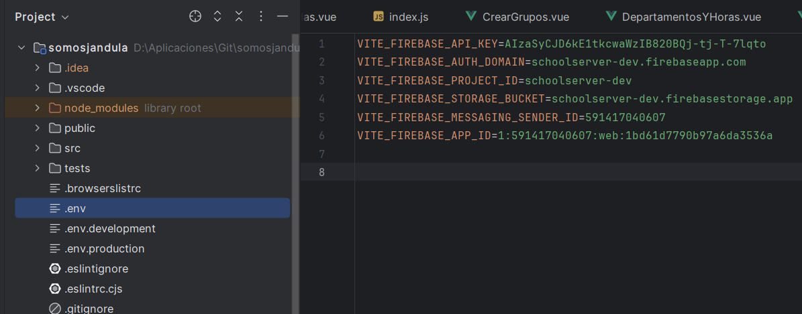

Para lanzar el proyecto web anterior, necesitamos instalar ``Node.js``, sino la consola no detecta ``npm``. Tras eso ejecutar el ``npm install`` en la consola cmd, en la raíz del proyecto. Por último, podemos ejecutar el front con ``npm run dev``.
