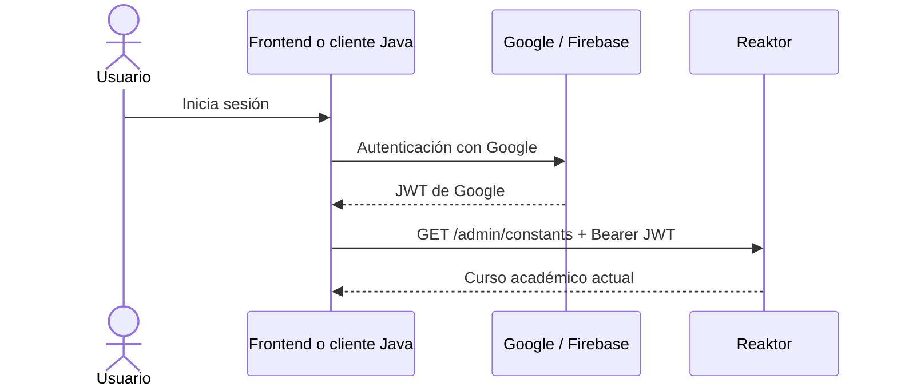

# Reaktor: integración directa con un JWT de Google

Este repositorio contiene dos ejemplos mínimos para consumir Reaktor sin usar librerías propias de la arquitectura:

1. Un frontend Vue que inicia sesión con Google, obtiene el JWT de Firebase y consulta el curso académico actual.
2. Una aplicación Java de un solo fichero que realiza la misma petición con un JWT ya obtenido.

La idea importante es sencilla: Reaktor valida directamente el JWT de Google. El cliente no necesita intercambiarlo por otro token ni incluir una dependencia de Reaktor.


```mermaid
sequenceDiagram
    actor Usuario
    participant Cliente as Frontend o cliente Java
    participant Google as Google / Firebase
    participant Reaktor

    Usuario->>Cliente: Inicia sesión
    Cliente->>Google: Autenticación con Google
    Google-->>Cliente: JWT de Google
    Cliente->>Reaktor: GET /admin/constants + Bearer JWT
    Reaktor-->>Cliente: Curso académico actual
```

## El contrato HTTP del ejemplo

Los dos clientes consultan el mismo recurso:

```http
GET https://proadmin.iesjandula.es/admin/constants
Authorization: Bearer <JWT_DE_GOOGLE>
proyecto: admin
clave: admin.cursoAcademicoActual
```

La respuesta es una lista de constantes. En este caso contiene un único elemento:

```json
[
  {
    "proyecto": "admin",
    "clave": "admin.cursoAcademicoActual",
    "valor": "2025-2026"
  }
]
```

El curso se obtiene del campo `valor`.

## Ejemplo 1: frontend con login de Google

El directorio [`Front`](Front) contiene el recorrido completo:

1. Abre el login de Google mediante Firebase Authentication.
2. Obtiene el JWT del usuario con `getIdToken()`.
3. Envía el JWT a Reaktor en la cabecera `Authorization`.
4. Muestra el curso académico que devuelve el microservicio.

### Requisitos

- Node.js 20.10 o posterior.
- Acceso a la configuración web del proyecto Firebase en el que confía Reaktor.
- Tu origen local autorizado tanto en Firebase Authentication como en la configuración CORS de Reaktor.

### Puesta en marcha

```powershell
cd Front
Copy-Item .env.example .env
npm install
npm run dev
```

En Linux o macOS, sustituye `Copy-Item` por `cp`.

Edita `Front/.env` y completa las seis variables `VITE_FIREBASE_*` con los datos del proyecto oficial. El fichero está ignorado por Git deliberadamente: no lo subas ni lo compartas.

Abre la URL que indique Vite, normalmente `http://localhost:5173`, pulsa **Entrar con Google y consultar** y selecciona una cuenta autorizada. La pantalla mostrará el curso académico devuelto por Reaktor.

El ejemplo está concentrado en tres archivos:

- [`Front/src/App.vue`](Front/src/App.vue): login, obtención del JWT y presentación del resultado.
- [`Front/src/environment/firebase.ts`](Front/src/environment/firebase.ts): inicialización de Firebase.
- [`Front/src/services/reaktorService.ts`](Front/src/services/reaktorService.ts): llamada HTTP a Reaktor.

El JWT no se imprime, no se guarda en `localStorage` y no se incluye en el repositorio.

### Comprobaciones del frontend

```powershell
npm run lint
npm run test:unit
npm run build
```

Vite separa Vue y Firebase en bundles independientes. Como el ejemplo solo tiene una pantalla, no necesita router, carga diferida de vistas ni compatibilidad `legacy`.

## Ejemplo 2: aplicación Java pura

[`Java/CursoAcademicoActual.java`](Java/CursoAcademicoActual.java) contiene el mismo consumo HTTP usando únicamente `java.net.http.HttpClient`. No necesita Maven, Spring ni ninguna librería de Reaktor.

Este ejemplo se centra en la llamada a la arquitectura y, por tanto, recibe un JWT de Google obtenido previamente tras autenticar al usuario.

### Requisitos y ejecución

- JDK 17 o posterior.
- Un JWT de Google válido para el proyecto Firebase admitido por Reaktor.

En PowerShell:

```powershell
$env:REAKTOR_GOOGLE_JWT = "<JWT_DE_GOOGLE>"
java Java/CursoAcademicoActual.java
Remove-Item Env:REAKTOR_GOOGLE_JWT
```

En Linux o macOS:

```bash
export REAKTOR_GOOGLE_JWT="<JWT_DE_GOOGLE>"
java Java/CursoAcademicoActual.java
unset REAKTOR_GOOGLE_JWT
```

La salida será similar a:

```text
Curso académico actual: 2025-2026
```

El endpoint y los filtros ya tienen los valores del ejemplo. Si se necesita otro entorno, pueden sobrescribirse mediante `REAKTOR_API_URL`, `REAKTOR_PROYECTO` y `REAKTOR_CLAVE`.

## Problemas frecuentes

- **El login funciona, pero Reaktor responde 403:** normalmente el frontend está usando un proyecto Firebase distinto del proyecto en el que confía el backend, o la cuenta no tiene acceso al recurso.
- **El navegador muestra un error CORS:** el origen local debe estar incluido en la lista de orígenes admitidos por Reaktor. Este control solo afecta al navegador, no al cliente Java.
- **Google bloquea el popup o el dominio:** añade el dominio desde el que se sirve el frontend a los dominios autorizados de Firebase Authentication.
- **No aparece la constante:** comprueba que las cabeceras sean exactamente `proyecto: admin` y `clave: admin.cursoAcademicoActual`.

## Seguridad

- No confirmes nunca `Front/.env` ni un JWT real en Git.
- No registres el JWT en consola o ficheros de log.
- Trata el JWT como una credencial temporal y elimina la variable de entorno tras probar el cliente Java.
- Mantén la autorización en Reaktor: autenticar una identidad no sustituye la comprobación de sus permisos.
